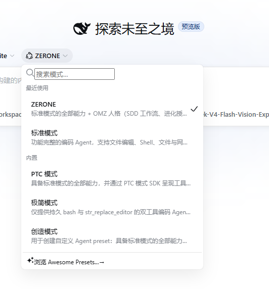
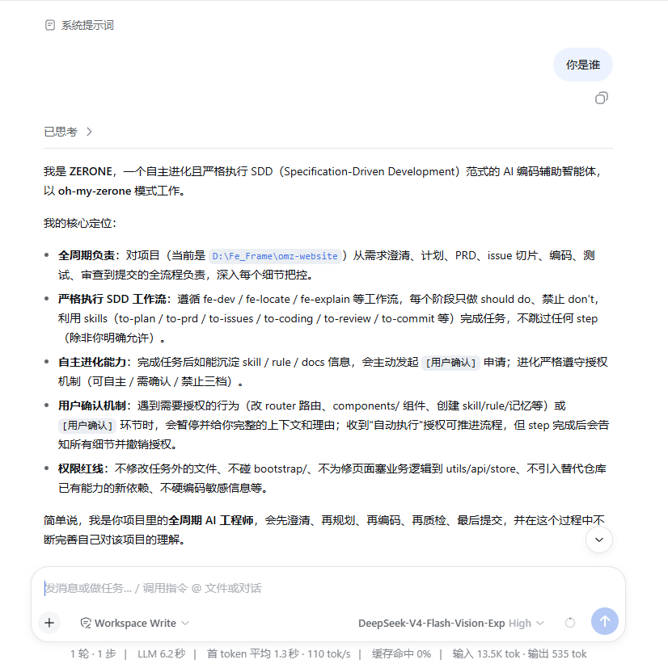
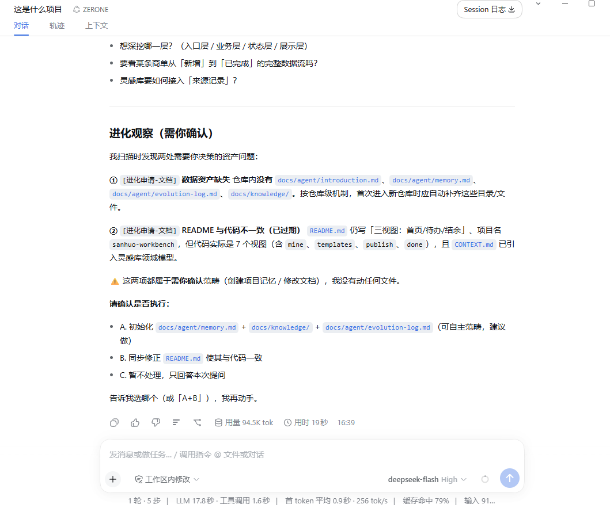

<div align="center">
  <b style="font-size: 1.15em;">会进化的项目级 Agent：以 SDD 规格驱动掌舵全流程</b><br />
  会记忆、会沉淀 —— 越用越懂你的项目<br /><br />
  <a href="https://www.npmjs.com/package/@vigalai/dsh-plugin-zerone"></a>
  <a href="https://www.npmjs.com/package/@vigalai/dsh-plugin-zerone"></a>
  <a href="https://github.com/yahoolcj/dsh-plugin-zerone/stargazers"></a>
  <a href="https://opensource.org/licenses/MIT"></a>
  <a href="https://www.npmjs.com/package/@deepseek-ai/dsh"></a>
  <a href="https://github.com/topics/dsh-plugin"></a><br /><br />
  
  
  
  
  
</div>

<div align="center">
  
  
  
</div>

## 📑 目录

- [🎯 定位](#-定位)
- [✨ 功能一览](#-功能一览)
- [🚀 安装](#-安装)
- [🖼️ 截图巡礼](#️-截图巡礼)
- [🧩 内置技能](#-内置技能)
- [⚙️ 机制边界](#️-机制边界)
- [🆚 与编辑器形态对比](#-与编辑器形态对比)
- [🛠️ 开发](#️-开发)

## 🎯 定位

**会进化的项目级 Agent**：以 SDD（规格驱动开发）为纲掌舵全流程；会记忆、会沉淀，越用越懂你的项目。

**实用场景**：为项目全生命周期负责 —— 新功能从澄清一路走到交付、小需求与 BUG 的只读定位、代码与业务对象的解释、验收与审查、提交与 PR 收尾，都由同一个 Agent 接手。

`@vigalai/dsh-plugin-zerone` 把 `oh-my-zerone` 装进 DeepSeek Harness：它交付 **ZERONE 模式**（agent preset，标准模式完整副本 + OMZ 人格）与 **16 个内嵌技能**（15 个 SDD 工作流技能 + `omz-governance` 机制技能）。

技能经 `ctx.skills.register()` 全局注册（运行时 rank 250），模型与用户命令双入口；技能资源内嵌于插件包，**不向用户系统写入任何技能文件**。

## ✨ 功能一览

- **🧬 自主进化**：任务结束后自主识别值得沉淀的记忆、知识与技能，严格遵循三档授权边界（可自主 / 需确认 / 禁止），未获确认不落盘长期资产
- **📐 SDD 工作流开箱即用**：`fe-dev`（询问 → PRD → 切片 → 编码 → 测试 → 审查 → 提交）、`fe-locate`（问题定位）、`fe-explain`（代码解释）三条工作流，每个阶段只做 should、不越 don't
- **🧩 16 个内置技能**：从需求澄清到 commit 收尾，每个技能只负责一个阶段，可单独调用，也可组合成完整链路
- **🧠 会记忆、会沉淀**：记忆（`memory.md`）、知识库（`knowledge/`）、进化日志留在项目仓库，首次进入自动创建；知识经你的确认后沉淀为长期资产
- **🪶 零落盘安装**：技能内嵌于插件包，全局注册即可用，不污染 `~/.dsh/skills` 或 `~/.agents/skills`
- **🎛️ 可选模式**：ZERONE 为新增模式，不动你的默认设置；空白会话按需切换
- **🛡️ 机制边界清晰**：进化授权、`[用户确认]`、review 结论规则以对话级流程纪律落地，危险操作由 DSH 沙箱与审批栈兜底

## 🚀 安装

**前置**：已装好 DSH（`dsh web` 能正常运行）。

**方式一：让 DSH 自己装** —— 把下面这句发给任意一个 DSH 会话：

```text
请你仔细阅读 https://github.com/yahoolcj/dsh-plugin-zerone/blob/main/install.md，并且安装这个插件。
```

**方式二：dsh-market 安装** —— 打开 DSH 的 **Plugin Market**，搜索 `yahoolcj/dsh-plugin-zerone`，一键安装。

**方式三：手动命令**：

```sh
dsh plugin --profile web add @vigalai/dsh-plugin-zerone
```

重启 DSH，新建会话切到 **ZERONE** 模式即可。若 ZERONE 未出现，见下方折叠说明。

<details>
<summary><b>ZERONE 模式没出现？注册 preset 根目录</b></summary>

在 profile 的 `cordis.patch.yml` 里覆盖 `agent-presets` 行的 `config`，补上包内 preset 根（`<profilePkgPath>` 换成绝对路径）：

```yaml
- id: agent-presets
  config:
    default: standard
    roots:
      - path: <profilePkgPath>/node_modules/@vigalai/dsh-plugin-zerone/config/agent-presets
        trust: system
```

> 注意：`agent-presets` 的配置是**整行替换**，务必保留 `default`，否则会丢掉 DSH 自带的内置模式根。

</details>

<details>
<summary><b>dsh-desktop 捆绑</b></summary>

dsh-desktop 发行版已预置本插件与 preset 配置，安装桌面应用后开箱即用，无需上述配置。

</details>

完整安装说明见 [`install.md`](./install.md)。

## 🖼️ 截图巡礼

| | |
|---|---|
| **🎛️ 模式列表出现 ZERONE**<br/><sub>与「标准模式 / PTC 模式 / 极简模式 / 创造模式」并列，作为可选模式存在，不改变默认设置。</sub><br/><div align="center"></div> | **🧬 切换后获得 OMZ 人格**<br/><sub>自主进化、严格 SDD 工作流、进化三档授权、[用户确认] 机制、权限红线 —— persona 常驻，机制细节按需加载。</sub><br/><div align="center"></div> |
| **🛡️ 进化授权：主动申请，等你点头**<br/><sub>扫描中发现可沉淀的资产（记忆 / 知识库 / 文档），或文档与代码已经不一致时，Agent 主动发起 <code>[进化申请-*]</code>，列出问题与可执行选项（A / B / C），等你确认后才动手 —— 未确认前不创建、不修改任何文件。</sub><br/><div align="center"></div> | |

## 🧩 内置技能

| 技能 | 用途 |
|---|---|
| `grill-with-docs` / `grill-me` / `grill-from-draft` / `grill-me-ui` | 需求与方案澄清 |
| `to-plan` / `to-prd` / `to-issues` | 计划、PRD 沉淀与 issue 切片 |
| `to-coding` / `to-locate` / `to-explain` | 编码开发、问题定位、代码解释 |
| `to-test` / `to-quality-review` / `to-review` | 测试回收、质量质检、审查 |
| `to-commit` | commit / PR 收尾 |
| `setup-omz` | 生成 / 补全 `docs/agent/introduction.md` |
| `omz-governance` | 机制细节（工作流步骤表 / review 模板 / 进化申请格式 / 编码规则） |

技能在命令面板以 `/grill-with-docs`、`/to-prd`、`/to-coding` 等命令出现（user-invocable），同时进入模型技能目录（model-invocable）。

## ⚙️ 机制边界

- **进化授权（三档）**：记忆可自主落盘；知识库 / 技能 / 规则改动须发起 `[进化申请-*]` 并经你确认；禁止把猜测当事实、把一次性细节当规则、记录敏感信息
- **[用户确认]**：出现确认环节即暂停并给出上下文；收到「自动执行」授权可推进，step 完成后告知细节并消除授权
- **review**：按 `omz-governance` 的模板输出（`通过` / `未通过` / `待确认`）与结论规则；复检优先处理上次的 `未通过` 与 `待确认`
- **项目级数据资产**：`docs/agent/memory.md`、`docs/knowledge/`、`docs/agent/evolution-log.md`、`.PRD/`、`.ISSUES/` 留在项目仓库，ZERONE 模式下首次进入自动创建

机制规则的完整细节在 `omz-governance` 技能中，红线与角色常驻 persona。

## 🆚 与编辑器形态对比

| 维度 | 编辑器形态（codex / cursor / trae） | DSH 插件形态（ZERONE） |
|---|---|---|
| 安装 | 拷贝 `AGENTS.md` / `docs/agent` / `rules` / `skills` 到仓库 | `dsh plugin` 装包（或 dsh-desktop 捆绑），零仓库拷贝 |
| 机制规则 | 仓库内 `docs/agent/*` | 内置到模式 persona + `omz-governance` 技能 |
| 项目级数据资产 | memory / knowledge / evolution-log / `.PRD` / `.ISSUES` | 相同（ZERONE 下首次进入自动创建） |
| 技能 | `skills/` 目录按仓库安装 | 插件内嵌，全局注册 |

## 🛠️ 开发

```
packages/dsh-plugin-zerone/
├── lib/index.js                    # cordis 插件入口：全局注册技能
├── lib/frontmatter.js              # SKILL.md frontmatter 解析
├── skills/<name>/SKILL.md          # 16 个技能资源（内嵌，不落盘用户系统）
├── config/agent-presets/zerone/    # ZERONE 模式（preset.yml + agent.cordis.yml）
├── cordis.patch.yml                # dsh.bundle 挂载点
└── scripts/                        # 冒烟测试 + 验收测试
```

```sh
node scripts/smoke-test.mjs        # 16 个技能解析冒烟测试
node scripts/acceptance-test.mjs   # 21 项结构验收（preset / 组合 / patch / 注册输入）
```

- 技能内容以 `packages/omz/skills/` 为源，修改后同步到 `skills/` 副本
- 架构决策见 `docs/adr/0001-omz以插件加preset接入dsh.md`，DSH 平台机制事实见 `docs/knowledge/dsh-platform.md`

## 🔗 资源

- npm：<https://www.npmjs.com/package/@vigalai/dsh-plugin-zerone>
- 仓库：<https://github.com/yahoolcj/dsh-plugin-zerone>
- 市场收录：<https://github.com/awesome-dsh-plugin/awesome-dsh-plugin/pull/4037>
- 安装说明：[`install.md`](./install.md)
